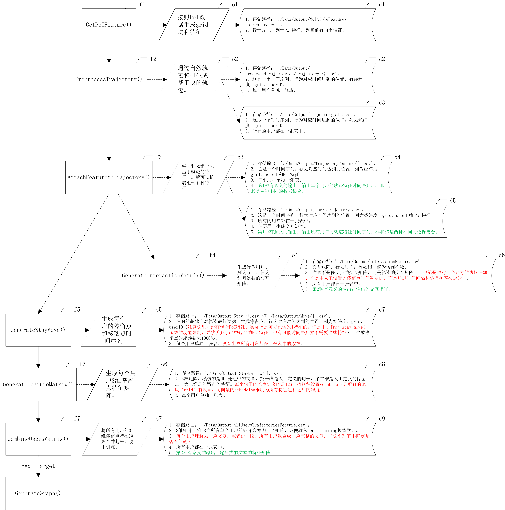

# GeoFeatureGeneration

generate various geographic characteristic/feature from PoI or other origin.

This package can not run in jupyter, because package has used "mulitprocessing".

在处理基础数据时以 transbigdata 包中的内容作为基础。transbigdata 主要是对数据做了预处理，但是并没有将数据转化为可以输入模型的形式。同时 transbigdata 在处理时有些处理无法满足输入机器学习模型的要求，因此做出了改进。

这个包可以将数据处理为各种需要的格式输出。以满足多种模型对数据的需求。其中以统计型矩阵、类似于自然语言的矩阵和时序的形式为主。从而满足多种机器学习算法的需求。

| number | city           | Regional scope               | description                       |
| ------ | -------------- | ---------------------------- | --------------------------------- |
| 1      | 北京经纬度范围 | 115.7, 39.4, 117.4, 41.6     | 北京目前之后北京大学提供的PoI数据 |
| 2      | 武汉经纬度范围 | 113.68, 29.97, 115.08, 31.37 | ......                            |

## publish information

| number | publish time | version | modify content                                                                                                            |
| ------ | ------------ | ------- | ------------------------------------------------------------------------------------------------------------------------- |
| 1      | 20240219     | 1.0.0   | can output matrix of trajectory.                                                                                          |
| 2      | 20240409     | 1.0.1   | output series of stay contain PoI feature.                                                                                |
| 3      | 20240625     | 1.0.2   | generate negative PoI feature of area.                                                                                    |
| 4      | 20241024     | 1.0.3   | because transbigdata package generate grid can't recover loncol and latcol, so use Cantor function to solve this problem. |
| 5  | 20241225   | 2.0.0  | separate the code of feature generate and feature attachment. when adding new feature, there is no need to rerun all code.                                                              |
|        |              |         |                                                                                                                           |
|        |              |         |                                                                                                                           |

## problom

1. ~~出现了完全不在北京市的轨迹，用户ID为118、132、160。在将轨迹特征和PoI特征合并时会出现KeyError的报错。~~
   1. 118的活动轨迹主要在内蒙古，距离最近的城市是黑龙江的齐齐哈尔。132的活动轨迹主要在宁波市和杭州市。160的活动轨迹主要在柬埔寨的暹粒市。
   2. 在试验的时候pandas.dataframe merge空数据集是没有报错的。还不清楚在 GenerateGeographicFeature.py 中为什么报错。
      1. 原因找到了：因为在对用户轨迹进行处理的函数中 PreprocessSingleTrajectoryMerged() 和 PreprocessSingleTrajectoryIndependent() 都做了 tbd.clean_outofbounds 处理。也就是将所有指定范围之外的轨迹删除了。这个时候用户ID为118、132、160三个用户的轨迹都处理指定范围之外，导致生成的轨迹dataframe虽然保留了列名，但是具体数据为空。而当使用 df_sampling = df_sampling.apply(GenerateGrid, axis=1) 生成grid的时候，由于具体数据为空，pandas的apply函数并不会生成一个新的'grid'列。所以导致 AttachFeaturetoSingleUserTrajectory() 和 MergeUsersTrajectoryandPoIFeature() 函数在合并 PoIFeature 和 用户轨迹数据时报 KeyError 的报错。
   3. 解决方法：将tbd.clean_outofbounds 放到 df_sampling = df_sampling.apply(GenerateGrid, axis=1) 之后来执行。
2. ~~直接的cantor配对函数只能应用在非负整数范围。很多坐标在计算格栅的时候为负值使用cantor配对函数出错。~~
   1. 参考:[https://www.bilibili.com/read/cv8399988/](https://www.bilibili.com/read/cv8399988/)
   2. 解决方法：将正整数和0折叠为自然数中的偶数，将负整数折叠为奇数。然后再使用cantor配对函数。
      folding function：

      $$
      f(n) = \left\{\begin{aligned}
            & 2n  & , \, & \text{if } n \geqslant 0\\
            & 2|n| - 1 = 2  & , \, & \text{otherwise}
            \end{aligned}\right.
      $$

      cantor pairing function: $z = \pi (x, y) = \frac{(x+y)(x+y+1)}{2} + y \, x,y\geqslant 0 \, ,x,y\in \mathbb{Z}. $
3. ~~tbd.traj_stay_move() 函数在生成 move['duration'] = ( move['etime'] - move['stime']).dt.total_seconds() 是没有像 生成stay['duration'] = (pd.to_datetime(stay['etime']) - pd.to_datetime(stay['stime'])).dt.total_seconds() 一样将 move['etime'] 和 move['stime'] 使用 pd.to_datetime() 方法转换。从而导致在 GenerateTimeFeature() 在生成时间的时候报错。~~
   1. 解决方法：修改transbigdata的源码。将transbigdata中的traj.py文件中的traj_stay_move()第729行修改为 move['duration'] = (pd.to_datetime((move['etime']) - pd.to_datetime((move['stime'])).dt.total_seconds() 。
4. ~~在GenerateSingleUserStayMove() 和 GenerateStayMoveByChunk() 方法使用过程中遇到了和1中一样的问题。也就是对于特定用户的 userTrajectory 是空的。导致没有生成grid列。~~
   1. 解决方法：判断读取的 userTrajectory 的形状是否没有内容。直接生成空的DataFrame来保存。GenerateStayMoveByChunk()可能由于多个用户共同的轨迹文件的体积大，所以没有出现上述症状。
5. ~~之前设置的北京的坐标范围[115.7, 39.4, 117.4, 41.6]有问题。上边界距离北京太远。~~
   1. 解决方法：现在设置为：gBounds = [115.4, 39.4, 117.55, 41.1]。经度越往东数值越大，是竖线。纬度越往北数值越大，是横线。参考[全国各省市经纬度范围](https://blog.csdn.net/esa72ya/article/details/114642127)，应该设置为：115.416827~117.508251，39.442078~41.058964。
6. ~~与问题1类似，在生成stay和move的时候，由于设置的判断stay时间间隔是30分钟，有些用户可能所有的停留时间都没有超过30分钟的情况。其中137、120、049、178、123生成的stay为空。所以导致合并特征的时候gird失败。~~
   1. 在生成stay的时候做判断，分别处理。
   2. **所有要做下采样或者缩小数据规模的操作都需要判断产生的数据为空了，从而导致合并数据失败！**
   3. 现在以下用户在生成数据的过程中所有的数据都被删除了。=132、-137、=118、-120、=160、-049、-178、-123。
7. GenerateStayMove(ProcessType='merged')  -> GenerateStayMoveByChunk() -> stay = stay.apply(cc.GenerateGrid, lonColName='LONCOL', latColName='LATCOL', axis=1) 这段代码在对多个chunk 并没有执行生成 grid，直接导致后面的代码执行失败。

## next plan

1. ~~完成geo特征的合并，在输出数据结构的时候使用合并之后的Geo特征。~~
2. move的特征需要特殊处理。因为move包含起点和终点，有两个地理特征。
3. ~~需要统一的列名。不能在不同的函数中使用不同的列名。特别是在生成PoI特征和用户轨迹时，经纬度列的命名方式有的是全称，有的是简写。需要统一。~~
   1. 解决说明：已经统一。使用康托配对函数实现。
4. 输出图结构的数据。
5. ~~使用cantor函数来生成唯一的grid编号。~~
6. ~~需要可以灵活的给用户的轨迹添加特征。~~
   1. 需要添加速度特征。对于 stay 添加的速度特征是与前一个stay之间的速度。这是不是意味这需要添加的是和前一个stay的距离？
   2. 新生成的特征可以通过函数直接附加到轨迹携带的特征上，从而不用每次都重新运行。
   3. 解决说明：每次生成新的poi特征，然后和trajectory合并。
7. ~~在没有生成stay和move之前，是否需要给轨迹添加PoI特征？需要思考，因为 transbigdata.traj_stay_move() 函数会将除它选择的列都删除。~~
   1. ~~可以修改 transbigdata 的函数。~~
   2. 也可以自己编写函数来生成stay和move。
   3. 解决说明：这个影响不大。
8. ~~其中 AttachFeaturetoTrajectory() 的 elif outputType == 'merged': 部分代码非常耗时，需要改进。~~
   1. 还没有好的方法来提高速度。
   2. merge 中的 sort=True参数对数据进行排序，这可以加快合并的速度。但是将PoI和trajectory合并的时候，trajectory并不是按照grid进行顺序进行排列的；而是按照时间顺序进行排列的。
   3. join 需要合并的两个数据的index是需要合并比对的对象（join用于将两表按照索引列进行合并）；而trajectory不可能将grid作为index。理论上join会比merge快。
   4. concat用户堆叠，不能灵活的按指定列进行合并。
   5. 使用polars来解决这个问题。特别是解决merge速度慢的问题。
9.  每个地域的特征是随着用户和时间变化而变化的。比如用户在白天访问一个地域的医院，但是在晚上访问同一个地域的超市。由于时间的变化，同一个地域的特征表现是不一样的。同样的不同的用户也访问同一个不同特征。
   1. 需要通过一个模型来学习不同时间地域的不同特征表现。不同的人不同时间访问同一地域会生成该地域的不同特征。time2vec模型。如果没有明确用户的特制的情况下，用用户的轨迹来描述用户的特征。有明确用户特征的，直接用用户特征来区分用户。参考GETNext论文中的表述。
10. ~~**对于问题1, 4, 6 需要统一的解决方法。**~~
    1. 特别是在函数 GenerateSingleUserStayMove() 中填充了人工输入的列名。需要通过之前合并的数据来获取列名并填充这才合理。
    2. 另外对于所有的进行下采样或者缩小数据规模的操作都需要判断产生的数据为空了，而且需要做一个统一的处理。
11. 可以思考包含的PoI特征：兴趣点（POI, Point of Interest）数据的特征提取是地理信息处理和分析的重要环节。根据不同的应用场景，POI可以提取以下主要特征：
    1. 基本属性特征
      - 名称（Name）：POI的具体名称。
      - 类别（Category）：POI所属的功能类型，例如餐馆、学校、超市、医院等。
      - 地址（Address）：POI的详细地址信息。
      - 地理坐标（Location）：POI的经纬度坐标。
    2. 空间特征
      - 距离特征：与其他POI的距离，与用户当前位置的距离。
      - 分布特征：POI在空间中的密度或分布模式，例如聚集区还是分散区。
      - 邻域特征：POI周围的一定范围内其他POI的数量和类别。
    3. 时间特征
      - 开放时间（Opening Hours）：POI的开放时间范围。
      - 访问时间分布：用户访问该POI的时间统计，例如高峰时段。
      - 动态变化特征：POI的时序特性，例如随时间变化的客流量。
    4. 用户行为特征
      - 访问频率（Visit Frequency）：用户访问POI的次数。
      - 用户停留时间（Dwell Time）：用户在POI的平均停留时间。
      - 用户偏好（User Preference）：访问该POI的用户偏好，例如餐馆口味、活动类型。
    5. 社交特征
      - 评论数量（Review Count）：POI的评论或评价数量。
      - 评分（Rating）：用户对该POI的评分。
      - 分享行为（Sharing Behavior）：用户在社交媒体中对POI的提及或分享频次。
    6. 上下文特征
      - 天气特征：访问POI时的天气状况，例如晴天、雨天。
      - 节假日特征：访问是否发生在节假日。
      - 事件特征：POI附近是否有大型活动或事件发生。
    7. 行业特征
      - 经营规模：POI的占地面积或规模。
      - 收入水平：POI的平均收入水平（如餐馆的客单价）。
      - 行业类型：POI是否属于特定行业分类。
    8. 网络连接特征
      - 交通可达性：与交通设施的距离，例如地铁站、公交站。
      - 路径特征：用户从当前位置到达该POI的路径或通行方式。
      - 相邻POI连接：与其他POI的逻辑或物理连接，例如商场内的不同店铺。
    9. 视觉特征
      - 图片描述：POI的图片或视觉描述特征。
      - 地标性：POI是否具有标志性特征（如著名景点）。
      - 通过对这些特征的提取和分析，可以为推荐系统、城市规划、商圈分析等应用场景提供有效支持。
12. foursquare 数据处理参考：
    1. <https://www.kaggle.com/code/ryotayoshinobu/foursquare-lightgbm-baseline>
    2. 重点-<https://zhuanlan.zhihu.com/p/540416289>
    3. <https://github.com/hobbitlab/Foursquare-Location-Matching>
    4. <https://jishu.proginn.com/doc/7780647801f904d12>
13. ~~需要使用polars来完全替换pandas。因为polars速度确实快（至少缩短了2个数量级的时间）。~~
    1. 还不能完全替换，因为tranbigdata使用的是pandas。
    2. 但merge操作肯定需要替换的。
14. ~~生成地址携带的特征。因为单纯的poi特征没有表明方位信息，也就是说在东面的一个商场和西面的一个商场在poi特征上是一样的。但是他们距离用户的真实地址是不一样的。同时地址表明了地理上人文属性，比如国家、省份等。另外顺便也要将经纬度信息放入特征中，因为经纬度从另一个方面表明了相对的距离信息。同时经纬度有它的缺陷，明显的经纬度0-180之间有个突然的转换。所以只能作为特征一种。~~
    1. 使用stay中心经纬度作为特征。经纬度数值化的表示了方向和距离。


## Function desrciption

the target is to process the data into a format that enters machine learning.

This package can concat multi vectorized features to one matrix.



## process of shape change of output data

在仅使用社会开源PoI的情况下，**最终保存为3维数据时的第三个维度形状为26**。也就是特征矩阵的列数为26。

需要注意的是grid是通过 康托 函数通过列号和行号生成的。

注意，只需要注意shape中的第二个维度的值即可，第一个维度值是和业务具体相关的。

| number | name           | shape       | description                                                                                           | columns name                                                                                                                                                                                                                                                                              |
| ------ | -------------- | ----------- | ----------------------------------------------------------------------------------------------------- | ----------------------------------------------------------------------------------------------------------------------------------------------------------------------------------------------------------------------------------------------------------------------------------------- |
| 1      | PoIFeture      | (9062, 15)  | 只包含社会特征的PoI特征。                                                                             | 列名称：['0.0', '1.0', '2.0', '3.0', '4.0', '5.0', '6.0', '7.0', '8.0', '9.0', '10.0', '11.0', '12.0', '13.0', 'grid']。                                                                                                                                                                  |
| 2      | UserTrajectory | (28307, 22) | 将轨迹中的基本信息和PoI特征合并之后的特征。                                                           | 列名称：['latitude', 'longitude', 'alt', 'entireTime', 'loncol', 'latcol', 'grid', 'userID', '0.0', '1.0', '2.0', '3.0', '4.0', '5.0', '6.0', '7.0', '8.0', '9.0', '10.0', '11.0', '12.0', '13.0']。                                                                                      |
| 3      | stay           | (55, 9)     | 由 tbd.traj_stay_move() 函数通过 UserTrajectory 生成的停留点特征。注意move 的特征和stay的形状不一样。 | 列名称：[uid, 'stime', 'LONCOL', 'LATCOL', 'etime', 'lon', 'lat', 'duration', 'stayid']。                                                                                                                                                                                                 |
| 4      | stay           | (55, 10)    | 添加了gird之后的stay。                                                                                | 列名称：[uid, 'stime', 'LONCOL', 'LATCOL', 'etime', 'lon', 'lat', 'duration', 'stayid', 'grid']。                                                                                                                                                                                         |
| 5      | stay           | (86, 16)    | 将时间'stime'列有 GenerateTimeFeature() 函数生成了6个时间特征。                                       | 列名称：[uid, 'stime', 'LONCOL', 'LATCOL', 'etime', 'lon', 'lat', 'duration', 'stayid', 'grid', 'weekofyear', 'dayofweek', 'dayofyear', 'quarter', 'month', 'hour']。                                                                                                                     |
| 6      | stay           | (86, 30)    | 将stay和PoI特征合并之后生成的特征。                                                                   | 列名称：[uid, 'stime', 'LONCOL', 'LATCOL', 'etime', 'lon', 'lat', 'duration', 'stayid', 'grid', 'weekofyear', 'dayofweek', 'dayofyear', 'quarter', 'month', 'hour', '0.0', '1.0', '2.0', '3.0', '4.0', '5.0', '6.0', '7.0', '8.0', '9.0', '10.0', '11.0', '12.0', '13.0']。               |
| 7      | stay           | (86, 31)    | 由'stime'生成了'stimestamp'类之后的特征。                                                             | 列名称：[uid, 'stime', 'LONCOL', 'LATCOL', 'etime', 'lon', 'lat', 'duration', 'stayid', 'grid', 'weekofyear', 'dayofweek', 'dayofyear', 'quarter', 'month', 'hour', '0.0', '1.0', '2.0', '3.0', '4.0', '5.0', '6.0', '7.0', '8.0', '9.0', '10.0', '11.0', '12.0', '13.0', 'stimestamp']。 |
| 8      | stay           | (86, 26)    | 删除了['stime', 'etime', 'stayid', 'lon', 'lat']之后的特征。此为最终输出的特征。                      | 列名称：[uid, 'LONCOL', 'LATCOL', 'duration', 'grid', 'weekofyear', 'dayofweek', 'dayofyear', 'quarter', 'month', 'hour', '0.0', '1.0', '2.0', '3.0', '4.0', '5.0', '6.0', '7.0', '8.0', '9.0', '10.0', '11.0', '12.0', '13.0', 'stimestamp']。                                           |

[输出的日志详见](#log-of-changes-in-data-shape)。

### output data structure

1. netural time series. completed.
2. interaction matrxi. completed.
3. similar netural language matrix. completed.
4. graph structure. to be implemented.

| num | format             | describe                                                         |
| --- | ------------------ | ---------------------------------------------------------------- |
| 1   | statistical matrix | mainly used for collaborative filtering or matrix factorization. |
| 2   | language matrix    | mainly used for deep learning.                                   |
| 3   | time series        | mainly used for LSTM or others.                                  |
| 4   |                    |                                                                  |

## File structure

.
├─ README.md
├─ CommonCode.py # 公用代码。
├─ GenerateGeographicFeature.py # 特征生成。
├─ AttachFeature.py # 特征附着到轨迹上。
├─ Parameters.json
├─ OldVersion
│  ├─ GenerateGeographicFeature_v1.0.3.py # 弃用。
│  └─ GeoFeatureGeneration_v1.py # 弃用。
├─ Data
│  ├─ Foursquare # 20241214发布的 Foursquare PoI 特征数据。
│  |   └─ ...
│  ├─ BeiJing
│  │   └─ Data
│  │       ├─ AccommodationServices.csv
│  │       ├─ BusinessResidence.csv
│  │       ├─ CommunalFacilities.csv
│  │       ├─ Corporation.csv
│  │       ├─ FamousScenery.csv
│  │       ├─ FinancialandInsuranceServices.csv
│  │       ├─ GovernmentAgenciesandSocialOrganizations.csv
│  │       ├─ HealthCareServices.csv
│  │       ├─ LifeService.csv
│  │       ├─ Restaurant.csv
│  │       ├─ ScienceEducationandCulturalServices.csv
│  │       ├─ Shopping.csv
│  │       ├─ SportsLeisureServices.csv
│  │       └─ TransportationFacilitiesServices.csv
│  ├─ Geolife Trajectories 1.3
│  │   └─ Data
│  │       ├─ 000
│  |       │  └─ Trajectory
│  │       ├─ 001
│  |       │  └─ Trajectory
│  │       ├─ 002
│  |       │  └─ Trajectory
│  │       ├─ 003
│  |       │  └─ Trajectory
│  |       ...
│  │       ├─ 180
│  |       │  └─ Trajectory
│  |       └─ 181
│  |          └─ Trajectory
│  └─ Output
│      └─ MultipleFeatures
└─ Test

## Package dependence

| num | package                | version |
| --- | ---------------------- | ------- |
| 1   | pandas                 | 2.2.3   |
| 2   | numpy                  | 2.0.2   |
| 3   | multiprocessing/python | python >=3.9   |
| 4   | geopandas              |         |
| 5   | json                   |         |
| 6   | datetime               |         |
| 7   | transbigdata           |  0.5.3  |
| 8   | polars              | 1.19.0  |
|     |                        |         |
|     |                        |         |
|     |                        |         |

## Test dataset

| num | data name             | source                                                                                                                                       |
| --- | --------------------- | -------------------------------------------------------------------------------------------------------------------------------------------- |
| 1   | Microsoft GeoLife 1.3 | [Geolife GPS trajectory dataset – User Guide](https://www.microsoft.com/en-us/research/publication/geolife-gps-trajectory-dataset-user-guide/) |
| 2   | BeiJing PoI feature   | Geographic  Data Sharing Infrastructure, College of Urban and  Environmental Science, Peking University (http://geodata.pku.edu.cn)          |
| 3   |                       |                                                                                                                                              |
| 4   |                       |                                                                                                                                              |
| 5   |                       |                                                                                                                                              |
| 6   |                       |                                                                                                                                              |

## appendix

### Log of changes in data shape

生成地理特征代码中的打印，用于观测生成过程中的数据的形状变化情况打印。

```log
GPU00:/workspace/codespace/GeoFeatureGeneration$ /bin/python3 /workspace/codespace/GeoFeatureGeneration/GenerateGeographicFeature.py
Start function: GetSocialPoIFeature() ,pid: 68720 ,start at: 2024-10-28 17:51:25 .
./Data/Output/MultipleFeatures/SocialFeature.csv is exist, will overwrite.
End function: GetSocialPoIFeature() ,pid: 68720 ,completed time: 2024-10-28 17:52:55.877729 ,
            consume time: 0:01:30.502298 .
./Data/Output/PoIFeature.csv is exist, it will overwrite.

 Output PoI feature shape is (9062, 14). columns Index([0.0, 1.0, 2.0, 3.0, 4.0, 5.0, 6.0, 7.0, 8.0, 9.0, 10.0, 11.0, 12.0,
       13.0],
      dtype='float64').

GetPoIFeature completed. 0:01:30.612127
Start function: PreprocessTrajectory ,pid: 68720 ,start at: 2024-10-28 17:52:55 .

 Output all user trajectory shape is (1679880, 8). in this time, hast attach PoI feature.

End function: PreprocessTrajectory ,pid: 68720 ,completed time: 2024-10-28 17:58:06.391858 ,
            consume time: 0:05:10.404230 .
PreprocessTrajectory completed. 0:05:10.451671
Start function: AttachFeaturetoTrajectory() ,pid: 68720 ,start at: 2024-10-28 17:58:06 .

 1 007 PoIFeature shape is (9062, 15). columns Index(['0.0', '1.0', '2.0', '3.0', '4.0', '5.0', '6.0', '7.0', '8.0', '9.0',
       '10.0', '11.0', '12.0', '13.0', 'grid'],
      dtype='object').

 1 002 PoIFeature shape is (9062, 15). columns Index(['0.0', '1.0', '2.0', '3.0', '4.0', '5.0', '6.0', '7.0', '8.0', '9.0',
       '10.0', '11.0', '12.0', '13.0', 'grid'],
      dtype='object').

 1 005 PoIFeature shape is (9062, 15). columns Index(['0.0', '1.0', '2.0', '3.0', '4.0', '5.0', '6.0', '7.0', '8.0', '9.0',
       '10.0', '11.0', '12.0', '13.0', 'grid'],
      dtype='object').

 1 006 PoIFeature shape is (9062, 15). columns Index(['0.0', '1.0', '2.0', '3.0', '4.0', '5.0', '6.0', '7.0', '8.0', '9.0',
       '10.0', '11.0', '12.0', '13.0', 'grid'],
      dtype='object').

 1 004 PoIFeature shape is (9062, 15). columns Index(['0.0', '1.0', '2.0', '3.0', '4.0', '5.0', '6.0', '7.0', '8.0', '9.0',
       '10.0', '11.0', '12.0', '13.0', 'grid'],
      dtype='object').

 1 008 PoIFeature shape is (9062, 15). columns Index(['0.0', '1.0', '2.0', '3.0', '4.0', '5.0', '6.0', '7.0', '8.0', '9.0',
       '10.0', '11.0', '12.0', '13.0', 'grid'],
      dtype='object').

 1 003 PoIFeature shape is (9062, 15). columns Index(['0.0', '1.0', '2.0', '3.0', '4.0', '5.0', '6.0', '7.0', '8.0', '9.0',
       '10.0', '11.0', '12.0', '13.0', 'grid'],
      dtype='object').

 1 009 PoIFeature shape is (9062, 15). columns Index(['0.0', '1.0', '2.0', '3.0', '4.0', '5.0', '6.0', '7.0', '8.0', '9.0',
       '10.0', '11.0', '12.0', '13.0', 'grid'],
      dtype='object').

 1 001 PoIFeature shape is (9062, 15). columns Index(['0.0', '1.0', '2.0', '3.0', '4.0', '5.0', '6.0', '7.0', '8.0', '9.0',
       '10.0', '11.0', '12.0', '13.0', 'grid'],
      dtype='object').

 1 000 PoIFeature shape is (9062, 15). columns Index(['0.0', '1.0', '2.0', '3.0', '4.0', '5.0', '6.0', '7.0', '8.0', '9.0',
       '10.0', '11.0', '12.0', '13.0', 'grid'],
      dtype='object').

 1 006 UserTrajectory shape is (28307, 22). columns Index(['latitude', 'longitude', 'alt', 'entireTime', 'loncol', 'latcol',
       'grid', 'userID', '0.0', '1.0', '2.0', '3.0', '4.0', '5.0', '6.0',
       '7.0', '8.0', '9.0', '10.0', '11.0', '12.0', '13.0'],
      dtype='object').

 1 008 UserTrajectory shape is (77876, 22). columns Index(['latitude', 'longitude', 'alt', 'entireTime', 'loncol', 'latcol',
       'grid', 'userID', '0.0', '1.0', '2.0', '3.0', '4.0', '5.0', '6.0',
       '7.0', '8.0', '9.0', '10.0', '11.0', '12.0', '13.0'],
      dtype='object').

 1 009 UserTrajectory shape is (84567, 22). columns Index(['latitude', 'longitude', 'alt', 'entireTime', 'loncol', 'latcol',
       'grid', 'userID', '0.0', '1.0', '2.0', '3.0', '4.0', '5.0', '6.0',
       '7.0', '8.0', '9.0', '10.0', '11.0', '12.0', '13.0'],
      dtype='object').

 1 007 UserTrajectory shape is (87163, 22). columns Index(['latitude', 'longitude', 'alt', 'entireTime', 'loncol', 'latcol',
       'grid', 'userID', '0.0', '1.0', '2.0', '3.0', '4.0', '5.0', '6.0',
       '7.0', '8.0', '9.0', '10.0', '11.0', '12.0', '13.0'],
      dtype='object').

 1 005 UserTrajectory shape is (101187, 22). columns Index(['latitude', 'longitude', 'alt', 'entireTime', 'loncol', 'latcol',
       'grid', 'userID', '0.0', '1.0', '2.0', '3.0', '4.0', '5.0', '6.0',
       '7.0', '8.0', '9.0', '10.0', '11.0', '12.0', '13.0'],
      dtype='object').

 1 001 UserTrajectory shape is (108536, 22). columns Index(['latitude', 'longitude', 'alt', 'entireTime', 'loncol', 'latcol',
       'grid', 'userID', '0.0', '1.0', '2.0', '3.0', '4.0', '5.0', '6.0',
       '7.0', '8.0', '9.0', '10.0', '11.0', '12.0', '13.0'],
      dtype='object').

 1 000 UserTrajectory shape is (157482, 22). columns Index(['latitude', 'longitude', 'alt', 'entireTime', 'loncol', 'latcol',
       'grid', 'userID', '0.0', '1.0', '2.0', '3.0', '4.0', '5.0', '6.0',
       '7.0', '8.0', '9.0', '10.0', '11.0', '12.0', '13.0'],
      dtype='object').

 1 002 UserTrajectory shape is (223401, 22). columns Index(['latitude', 'longitude', 'alt', 'entireTime', 'loncol', 'latcol',
       'grid', 'userID', '0.0', '1.0', '2.0', '3.0', '4.0', '5.0', '6.0',
       '7.0', '8.0', '9.0', '10.0', '11.0', '12.0', '13.0'],
      dtype='object').

 1 004 UserTrajectory shape is (393368, 22). columns Index(['latitude', 'longitude', 'alt', 'entireTime', 'loncol', 'latcol',
       'grid', 'userID', '0.0', '1.0', '2.0', '3.0', '4.0', '5.0', '6.0',
       '7.0', '8.0', '9.0', '10.0', '11.0', '12.0', '13.0'],
      dtype='object').

 1 003 UserTrajectory shape is (417993, 22). columns Index(['latitude', 'longitude', 'alt', 'entireTime', 'loncol', 'latcol',
       'grid', 'userID', '0.0', '1.0', '2.0', '3.0', '4.0', '5.0', '6.0',
       '7.0', '8.0', '9.0', '10.0', '11.0', '12.0', '13.0'],
      dtype='object').

End function: AttachFeaturetoTrajectory() ,pid: 68720 ,completed time: 2024-10-28 17:58:12.830981 ,
            consume time: 0:00:06.391711 .
AttachFeaturetoTrajectory independent completed. 0:00:06.393024
Start function: AttachFeaturetoTrajectory() ,pid: 68720 ,start at: 2024-10-28 17:58:12 .

 User trajectory feature shape is (1679880, 22) after attach PoI feature. 

End function: AttachFeaturetoTrajectory() ,pid: 68720 ,completed time: 2024-10-28 18:06:53.067720 ,
            consume time: 0:08:40.235459 .
AttachFeaturetoTrajectory merged completed. 0:08:46.848839
Start function: GenerateInteractionMatrix() ,pid: 68720 ,start at: 2024-10-28 18:06:53 .
End function: GenerateInteractionMatrix() ,pid: 68720 ,completed time: 2024-10-28 18:06:57.168352 ,
            consume time: 0:00:03.880209 .
GenerateInteractionMatrix completed. 0:00:03.896630
Start function: GenerateStayMove() ,pid: 68720 ,start at: 2024-10-28 18:06:57 .

 2 006 UserTrajectory shape is (28307, 22). 

 2 006 stay shape is (55, 9). 

 2 008 UserTrajectory shape is (77876, 22). 

 2 009 UserTrajectory shape is (84567, 22). 

 2 007 UserTrajectory shape is (87163, 22). 

 2.1 006 stay shape is (55, 10). 

 2 005 UserTrajectory shape is (101187, 22). 

 2 001 UserTrajectory shape is (108536, 22). 

 2 008 stay shape is (86, 9). 

 2 009 stay shape is (107, 9). 

 2 007 stay shape is (180, 9). 

 2.1 008 stay shape is (86, 10). 

 2 001 stay shape is (140, 9). 

 2 005 stay shape is (209, 9). 

 2.1 009 stay shape is (107, 10). 

 2 000 UserTrajectory shape is (157482, 22). 

 2.1 007 stay shape is (180, 10). 

 2.2 006 stay shape is (55, 16). 

2 Output single user stay shape is (55, 30).
006 feature has completed.

 2.1 001 stay shape is (140, 10). 

 2 002 UserTrajectory shape is (223401, 22). 

 2 000 stay shape is (497, 9). 

 2.1 005 stay shape is (209, 10). 

 2 002 stay shape is (348, 9). 

 2.2 008 stay shape is (86, 16). 

2 Output single user stay shape is (86, 30).
008 feature has completed.

 2 004 UserTrajectory shape is (393368, 22). 

 2.2 009 stay shape is (107, 16). 

2 Output single user stay shape is (107, 30).
009 feature has completed.

 2 003 UserTrajectory shape is (417993, 22). 

 2.1 000 stay shape is (497, 10). 

 2.1 002 stay shape is (348, 10). 

 2 004 stay shape is (1218, 9). 

 2.2 001 stay shape is (140, 16). 

2 Output single user stay shape is (140, 30).
001 feature has completed.

 2.2 007 stay shape is (180, 16). 

 2 003 stay shape is (1038, 9). 

2 Output single user stay shape is (180, 30).
007 feature has completed.

 2.2 005 stay shape is (209, 16). 

2 Output single user stay shape is (209, 30).
005 feature has completed.

 2.1 004 stay shape is (1218, 10). 

 2.1 003 stay shape is (1038, 10). 

 2.2 002 stay shape is (348, 16). 

2 Output single user stay shape is (348, 30).
002 feature has completed.

 2.2 000 stay shape is (497, 16). 

2 Output single user stay shape is (497, 30).
000 feature has completed.

 2.2 003 stay shape is (1038, 16). 

2 Output single user stay shape is (1038, 30).
003 feature has completed.

 2.2 004 stay shape is (1218, 16). 

2 Output single user stay shape is (1218, 30).
004 feature has completed.
End function: GenerateStayMove() ,pid: 68720 ,completed time: 2024-10-28 18:07:10.691792 ,
            consume time: 0:00:13.507059 .
Start function: GenerateStayMove() ,pid: 68720 ,start at: 2024-10-28 18:07:10 .
End function: GenerateStayMove() multiprocess completed. ,pid: 68720 ,completed time: 2024-10-28 18:07:20.424794 ,
            consume time: 0:00:09.731688 .
Output all users stays shape is (3902, 30).
End function: GenerateStayMove() ,pid: 68720 ,completed time: 2024-10-28 18:07:20.616948 ,
            consume time: 0:00:09.923833 .
GenerateStayMove completed. 0:00:23.434017
Start function: GenerateFeatureMatrix() ,pid: 68720 ,start at: 2024-10-28 18:07:20 .
3 stay shape (140, 30)
3.1 stay shape (140, 31)
001 SeriesToMatrix have completed. FeatureThirdDimension is 26
--- shareData.dat 26
3 stay shape (86, 30)
3.1 stay shape (86, 31)
008 SeriesToMatrix have completed. FeatureThirdDimension is 26
--- shareData.dat 26
3 stay shape (497, 30)
3.1 stay shape (497, 31)
000 SeriesToMatrix have completed. FeatureThirdDimension is 26
--- shareData.dat 26
3 stay shape (209, 30)
3.1 stay shape (209, 31)
005 SeriesToMatrix have completed. FeatureThirdDimension is 26
--- shareData.dat 26
3 stay shape (55, 30)
3.1 stay shape (55, 31)
006 SeriesToMatrix have completed. FeatureThirdDimension is 26
--- shareData.dat 26
3 stay shape (348, 30)
3.1 stay shape (348, 31)
002 SeriesToMatrix have completed. FeatureThirdDimension is 26
--- shareData.dat 26
3 stay shape (107, 30)
3.1 stay shape (107, 31)
009 SeriesToMatrix have completed. FeatureThirdDimension is 26
--- shareData.dat 26
3 stay shape (180, 30)
3.1 stay shape (180, 31)
007 SeriesToMatrix have completed. FeatureThirdDimension is 26
--- shareData.dat 26
3 stay shape (1218, 30)
3.1 stay shape (1218, 31)
004 SeriesToMatrix have completed. FeatureThirdDimension is 26
--- shareData.dat 26
3 stay shape (1038, 30)
3.1 stay shape (1038, 31)
003 SeriesToMatrix have completed. FeatureThirdDimension is 26
--- shareData.dat 26
--- gFeatureThirdDimension 26
End function: GenerateFeatureMatrix() ,pid: 68720 ,completed time: 2024-10-28 18:07:21.625091 ,
            consume time: 0:00:01.006364 .
GenerateFeatureMatrix completed. 0:00:01.033304
--ooo- gFeatureThirdDimension 0
FeatureThirdDimension 26, gFeatureThirdDimension 0
CombineUsersMatrix has completed.
CombineUsersMatrix completed. 0:00:00.150205
All completed. 0:15:56.426793
```
