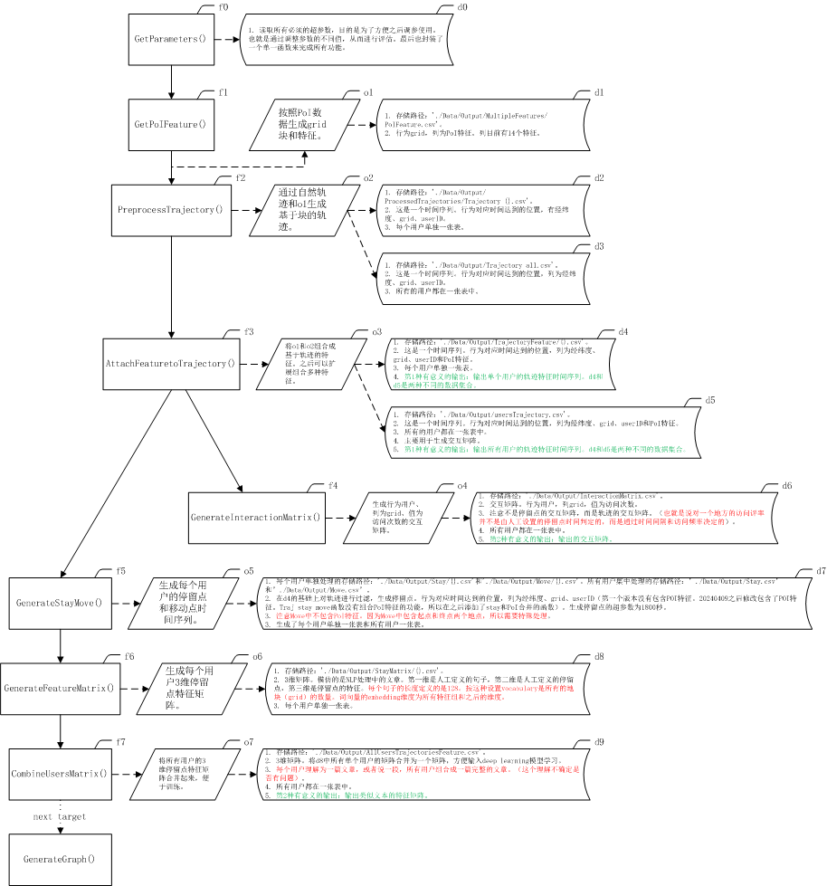

# GeoFeatureGeneration
generate various geographic characteristic/feature from PoI or other origin.

This package can not run in jupyter, because package has used "mulitprocessing".

在处理基础数据时以 transbigdata 包中的内容作为基础。transbigdata 主要是对数据做了预处理，但是并没有将数据转化为可以输入模型的形式。同时 transbigdata 在处理时有些处理无法满足输入机器学习模型的要求，因此做出了改进。

这个包可以将数据处理为各种需要的格式输出。以满足多种模型对数据的需求。其中以统计型矩阵、类似于自然语言的矩阵和时序的形式为主。从而满足多种机器学习算法的需求。

## publish information

|number|publish time|version|modify content|
|---|---|---|---|
|1|20240219|1.0.0|can output matrix of trajectory.|
|2|20240409|1.0.1|output series of stay contain PoI feature.|
|||||
|||||
|||||
|||||

## next plan

1. 完成geo特征的合并，在输出数据结构的时候使用合并之后的Geo特征。
2. move的特征需要特殊处理。因为move包含起点和终点，有两个地理特征。
3. 需要统一的列名。不能在不同的函数中使用不同的列名。
4. 输出图结构的数据。

## Function desrciption

the target is to process the data into a format that enters machine learning.

This package can concat multi vectorized features to one matrix.

### output data structure

1. netural time series. completed.
2. interaction matrxi. completed.
3. similar netural language matrix. completed.
4. graph structure. to be implemented.

## File structure

.
├─README.md
├─GeoFeatureGeneration.py
├─Parameters.json
├─Data
│  ├─BeiJing
│  │   └─Data
│  │       ├─AccommodationServices.csv
│  │       ├─BusinessResidence.csv
│  │       ├─CommunalFacilities.csv
│  │       ├─Corporation.csv
│  │       ├─FamousScenery.csv
│  │       ├─FinancialandInsuranceServices.csv
│  │       ├─GovernmentAgenciesandSocialOrganizations.csv
│  │       ├─HealthCareServices.csv
│  │       ├─LifeService.csv
│  │       ├─Restaurant.csv
│  │       ├─ScienceEducationandCulturalServices.csv
│  │       ├─Shopping.csv
│  │       ├─SportsLeisureServices.csv
│  │       └─TransportationFacilitiesServices.csv
│  ├─Geolife Trajectories 1.3
│  │   └─Data
│  │       ├─000
│  |       │  └─Trajectory
│  │       ├─001
│  |       │  └─Trajectory
│  │       ├─002
│  |       │  └─Trajectory
│  │       ├─003
│  |       │  └─Trajectory
│  |       ...
│  │       ├─180
│  |       │  └─Trajectory
│  |       └─181
│  |          └─Trajectory
│  └─Output
│      └─MultipleFeatures
└─Test

## Output format describe

|num|format|describe|
|---|---|---|
|1|statistical matrix|mainly used for collaborative filtering or matrix factorization.|
|2|language matrix|mainly used for deep learning.|
|3|time series|mainly used for LSTM or others.|
|4|||

## Package dependence

|num|package|version|
|---|---|---|
|1|pandas||
|2|numpy||
|3|multiprocessing/python|>=3.9|
|4|geopandas||
|5|json||
|6|datetime||
|7|||
|8|||
||||

## Test dataset

|num|data name|source|
|---|---|---|
|1|Microsoft GeoLife 1.3|[Geolife GPS trajectory dataset – User Guide](https://www.microsoft.com/en-us/research/publication/geolife-gps-trajectory-dataset-user-guide/)|
|2|BeiJing PoI feature|Geographic  Data Sharing Infrastructure, College of Urban and  Environmental Science, Peking University (http://geodata.pku.edu.cn)|
|3|||
|4|||
|5|||
|6|||